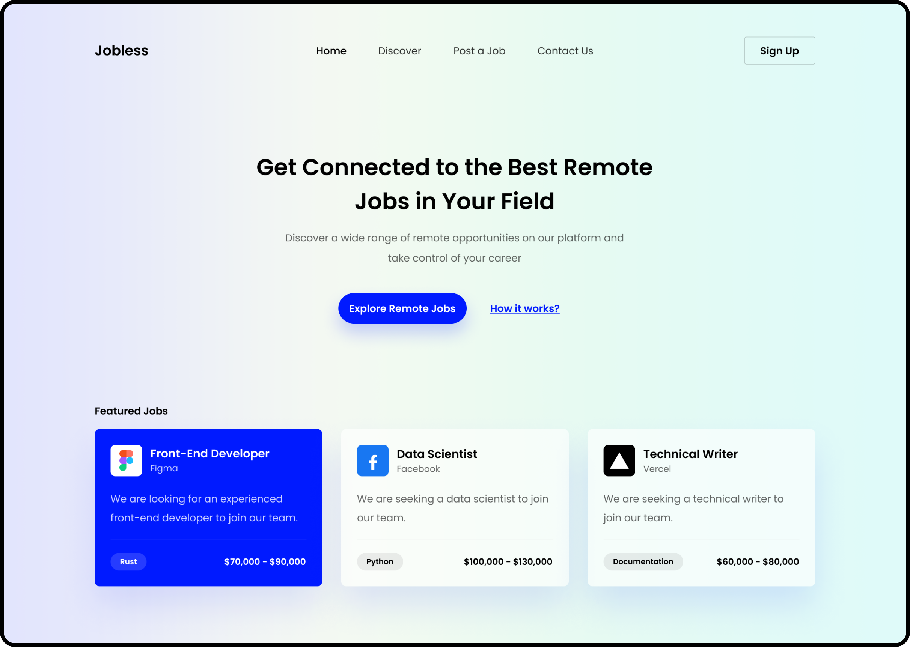

# Jobless

The Jobless Hero component is a visually striking and highly functional element of a job board website. It features a clean and modern design, with a centered headline, subheadline, and two call-to-action buttons. Underneath the headline and subheadline, there are three featured jobs that showcase the variety and quality of the job openings available on the website. The hero component is a key part of the website's overall aesthetic and user experience, and can be used to showcase the benefits and features of the job board, including the variety of job openings available and the ease of use of the search and application process.



## Installation

Clone this project

```bash
  git clone <this repo>
```

Move to directory project

```bash
  cd <folder name>
```

Install all package

```bash
  yarn install

  ## OR

  npm install
```

## Compile and Hot-Reload for Development

```bash
  yarn dev

  ## OR

  npm run dev
```

## Compile and Minify for Production

```bash
  yarn build

  ## OR

  npm run build
```

## Authors

- [@andikaPs](https://github.com/andikaPs)

## Demo

[Demo](https://slicing-jobless.vercel.app/)

## Tech Stack

**Client:** React, Bootstrap, Scss

## Design Source

- [codethedesign.dev/challenge/jobless](https://codedesign.dev/challenge/jobless)
